#### 实验环境
- 靶机：内部网络
- 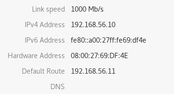
- 网关：内部网络
- 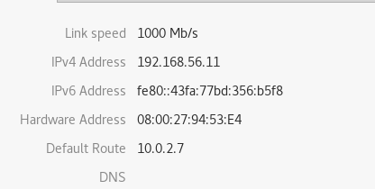
- 网关：NAT网络
- 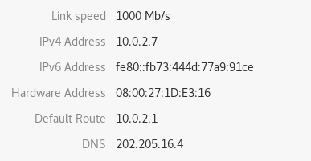
- 攻击主机：NAT网络
- 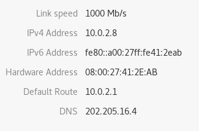
#### 实验过程
- 设置靶机的默认网关为网关的内部网卡接口(上图)
- 设置网关内部网卡接口的默认网关为网关的NAT网卡接口（上图）
- 开启网关的转发功能
```
vim /etc/sysctl.conf
net.ipv4.ip_forward=1
```
- 源地址转换
```
iptables -t nat -A POSTROUTING -s 192.168.56.0/24 -o eth1 -j MASQUERADE
```
这样从host回复的数据包才能会通过网关回到靶机


#### 实验结果
##### 靶机可以ping通攻击主机
- 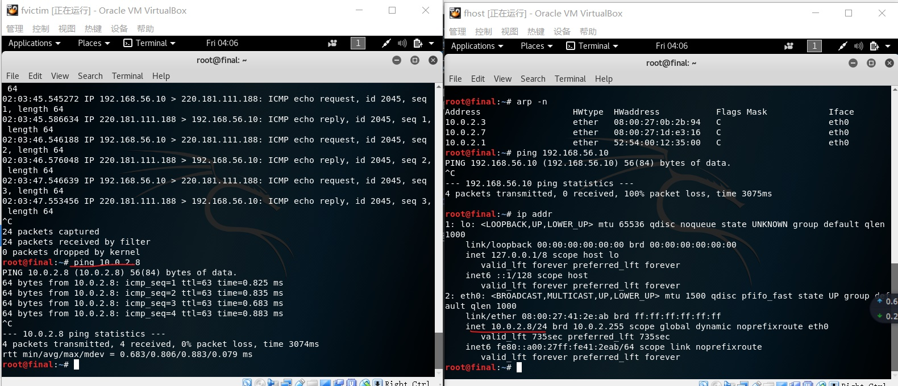
##### 攻击主机ping不通靶机
- 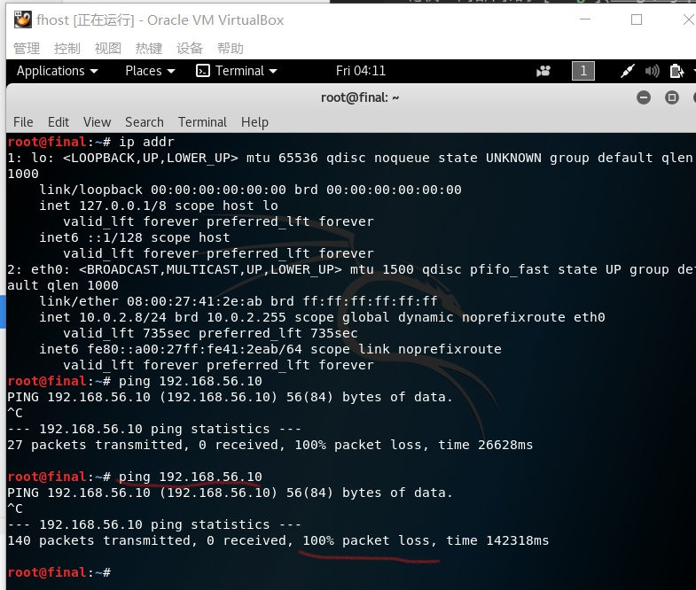
##### 网关可以ping通靶机和攻击主机
- 网关ping靶机
- 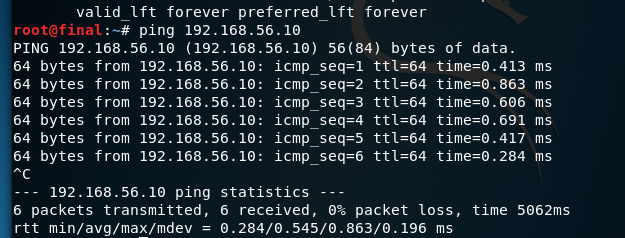
- 网关ping攻击主机
- 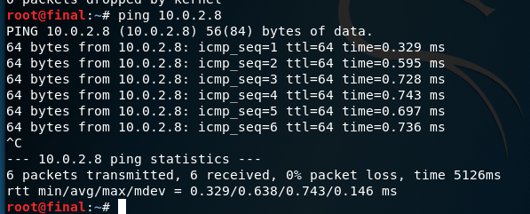
##### 靶机的流量都会经过网关
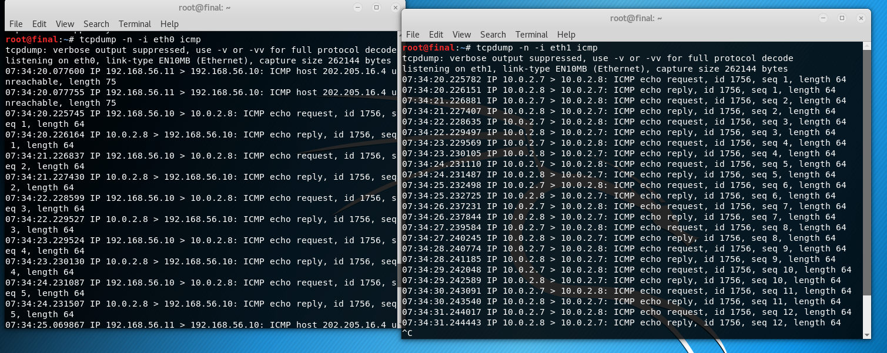
##### 靶机、网关、攻击主机都可以访问外网
- 靶机访问外网
- 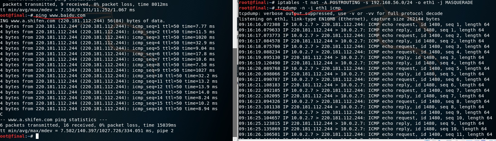
- 网关访问外网
- 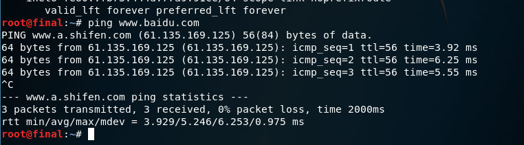
- 攻击主机访问外网
- 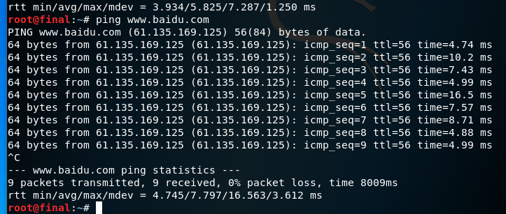
#### 实验中问题
- 实验中发现网关无法访问外网，当然也会导致靶机访问不了外网,查看到网关无法ping通DNS服务器，后来检查发现物理主机也无法ping通DNS服务器

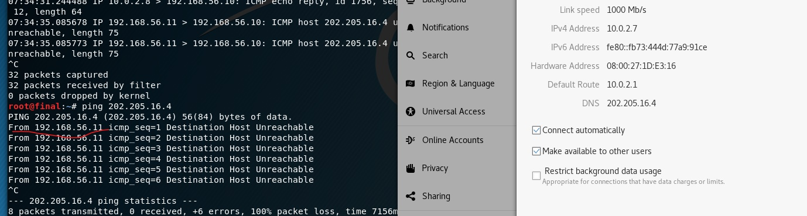

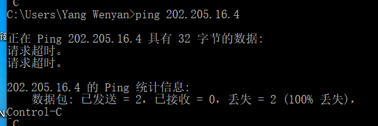
- 很是不理解，因为我的物理主机上网是完全没有问题的，后来了解到有些DNS服务器是防ping的，所以并不是DNS服务器的问题。从
图中发现，数据包是从192.168.56.11这个内网网络接口出去的，把这个网络断开后就可以正常访问网络了，再次打开后也能正常访问。


