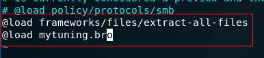
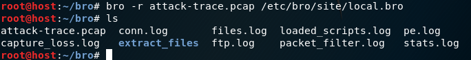
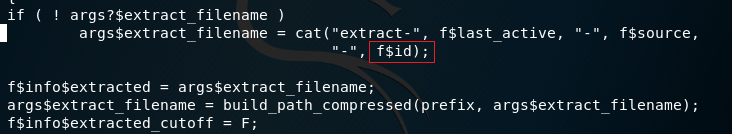
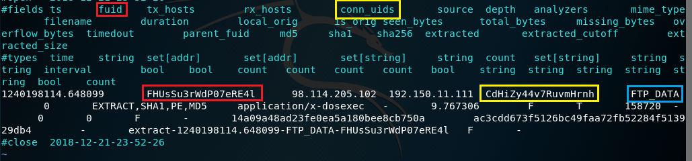
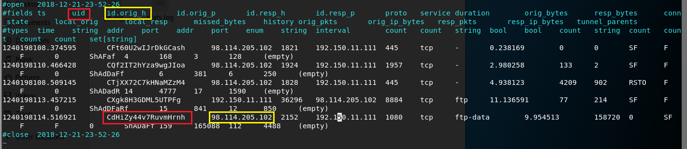
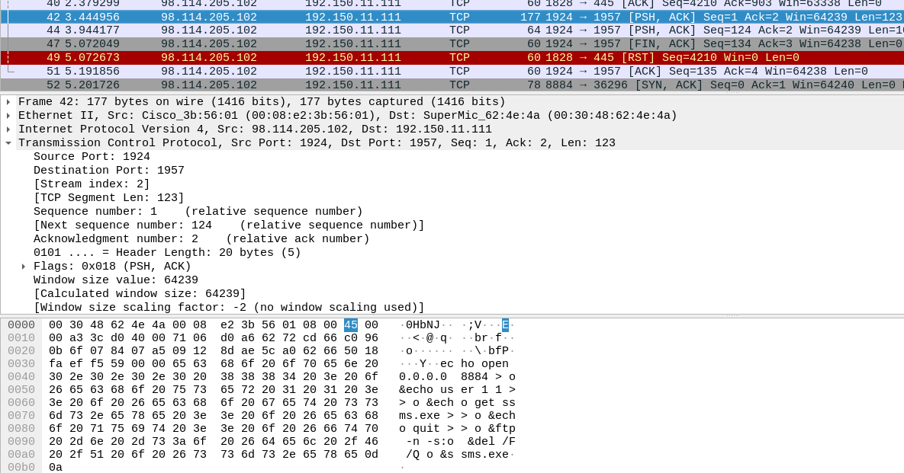

# 使用bro完成取证分析

## 安装bro

`apt-get install bro bro-aux`

## 编辑bro配置文件

- 在`/etc/bro/site/local.bro `文件末尾追加两行

    

- 在`/etc/bro/site`目录下创建`mytuning.bro`文件，内容为：
    
        redef ignore_checksums=T;
        redef Site::local_nets={192.150.11.0/24};

    - bro的事件引擎会丢弃没有有效校验和的数据包。如果想要在系统上分析本地生成/捕获流量，所有发送/捕获的数据包具有不良的校验和，因为它们尚未由NIC计算，因此这些数据包将不会在bro策略脚本钟进行分析，所以要设置忽略校验和验证

## 使用bro自动化分析pcap文件

    bro -r attack-trace.pcap /etc/bro/site/local.bro

- 在`attack-trace-pcap`文件的当前目录下会生成一些.log日志文件和`extract_files`目录

    

- 在extract_files目录下有一个文件

    

- 阅读`/usr/share/bro/base/files/extract/main.bro`源码

    

    - 最后一个字符串`FHUsSu3rWdP07eRE4l`是 `files.log` 中的文件唯一标识

- 查看`files.log`

    

    - 该文件提取自网络会话标识为`CdHiZy44v7RuvmHrnh`的FTP会话

- 查看`conn.log`

    

- wireshark

    

    - 可以发现该exe文件来自IP地址为`98.114205.102`的主机

## 参考
[基于bro的计算机入侵取证实战分析](https://www.freebuf.com/articles/system/135843.html)

[使用bro来完成取证分析](http://sec.cuc.edu.cn/huangwei/textbook/ns/chap0x12/exp.html)

    
    

