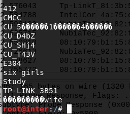
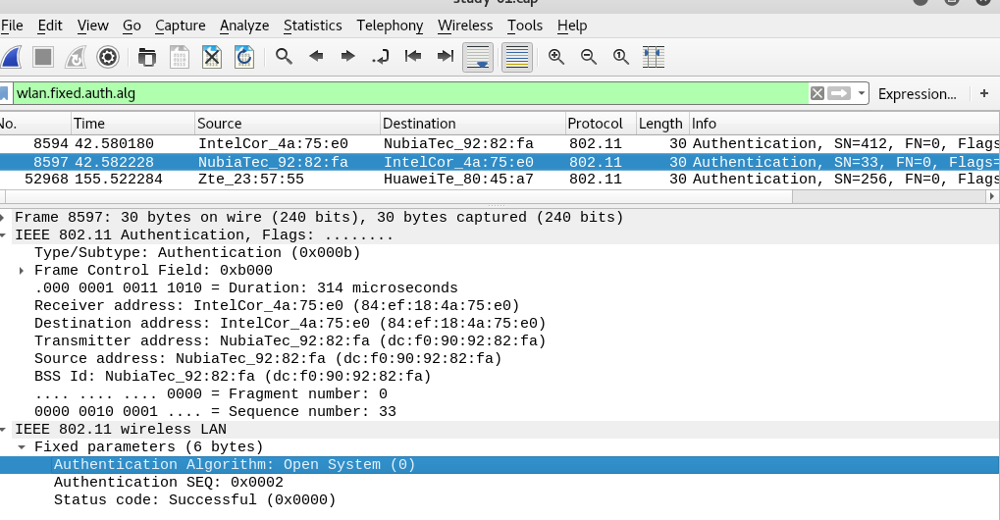
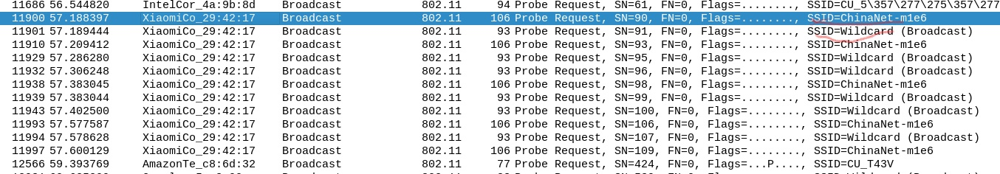
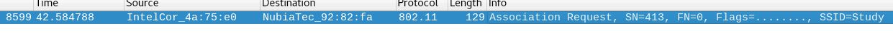
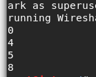

# 分析抓包保存的pcap文件 #

### 查看统计当前信号覆盖范围内一共有多少独立的SSID,其中是否包括隐藏SSID

- AP会广播`beacon frame`,`beacon frame`中有AP的SSID信息，可以从抓到的beacon帧中获取SSID信息`tshark -r /root/shared/final-01.cap -Y wlan.fc.type_subtype==0x08 -T fields -e wlan.sa -e wlan.ssid | sort -d -u`，结果如下!
 
	     08:10:79:b1:15:8c	six girls
	
	     0c:da:41:04:4a:b0	ChinaNet
	
	     0c:da:41:0d:94:30	ChinaNet

	     0c:da:41:22:28:50	ChinaNet
	
	     1c:60:de:ee:38:58	���������wife
	
	     30:99:35:6a:32:80	CU_T43V
	
	     52:1a:a9:c0:60:06	CMCC-WEB
	
	     52:1a:a9:c0:60:07	CMCC

		52:1a:a9:c0:60:08	CMCC-EDU
		
		52:1a:a9:c0:60:09	CUC
		
		52:1a:a9:c0:60:0a	and-Business
		
		62:fe:a1:d1:0a:ba	CU_5������1������4������
		
		80:f6:2e:13:b9:30	ChinaUnicom
		
		80:f6:2e:13:b9:31	17 Video Free
		
		80:f6:2e:13:b9:32	CU_Campus
		
		80:f6:2e:dc:b1:30	ChinaNet
		
		8c:a6:df:81:3b:4b	412
		
		8c:a6:df:81:3b:51	TP-LINK_3B51
		
		92:1a:a9:c1:f8:7b	CMCC
		
		92:1a:a9:c1:f8:7c	CMCC-EDU
		
		92:1a:a9:c1:f8:7d	CUC
		
		92:1a:a9:c1:f8:7e	and-Business
		
		9c:6f:52:6d:f5:ec	CU_D4bZ
		
		9c:6f:52:6e:bd:ed	CU_SHj4
		
		c8:64:c7:23:57:55	CMCC-WEB
		
		da:64:c7:23:57:55	CMCC
		
		dc:f0:90:92:82:fa	Study
		
		e4:f3:f5:05:48:36	E304
		
		ea:64:c7:23:57:55	and-Business

- 如果AP设置了ssid 隐藏，它的`beacon frame`中将不包含ssid信息或不广播`beacon frame`，即不会我们电子设备的可用网络中出现，如果有人在抓包过程中尝试连接这个AP，AP会发出`probe response`，其中会包含 AP的ssid信息

			08:10:79:b1:15:8c	six girls
			0c:da:41:22:28:50	ChinaNet
			30:99:35:6a:32:80	CU_T43V
			62:fe:a1:d1:0a:ba	CU_5������1������4������
			80:f6:2e:13:b9:30	ChinaUnicom
			80:f6:2e:13:b9:31	17 Video Free
			80:f6:2e:13:b9:32	CU_Campus
			80:f6:2e:dc:b1:30	ChinaNet
			8c:a6:df:81:3b:4b	412
			8c:a6:df:81:3b:51	TP-LINK_3B51
			9c:6f:52:6d:f5:ec	CU_D4bZ
			9c:6f:52:6e:bd:ed	CU_SHj4
			c8:64:c7:23:57:55	CMCC-WEB
			da:64:c7:23:57:55	CMCC
			dc:f0:90:92:82:fa	Study
			e4:f3:f5:05:48:36	E304

- 合并并以SSID去重后
		 
		80:f6:2e:13:b9:31	17 Video Free
		
		8c:a6:df:81:3b:4b	412
		
		52:1a:a9:c0:60:0a	and-Business
		
		0c:da:41:04:4a:b0	ChinaNet
		
		80:f6:2e:13:b9:30	ChinaUnicom
		
		52:1a:a9:c0:60:07	CMCC
		
		52:1a:a9:c0:60:08	CMCC-EDU
		
		52:1a:a9:c0:60:06	CMCC-WEB
		
		62:fe:a1:d1:0a:ba	CU_5������1������4������
		
		52:1a:a9:c0:60:09	CUC
		
		80:f6:2e:13:b9:32	CU_Campus
		
		9c:6f:52:6d:f5:ec	CU_D4bZ
		
		9c:6f:52:6e:bd:ed	CU_SHj4
		
		30:99:35:6a:32:80	CU_T43V
		
		e4:f3:f5:05:48:36	E304
		
		08:10:79:b1:15:8c	six girls
		
		dc:f0:90:92:82:fa	Study
		
		8c:a6:df:81:3b:51	TP-LINK_3B51
		
		1c:60:de:ee:38:58	���������wife` #社会的wifi

所以当前信号覆盖范围内有19个独立的ssid,并没有发现隐藏的ssid
###哪些无线热点是加密/非加密的？加密方式是否可知
####这里的是加密理解为STA加入时的认证
    
- 是否加密,即连接时是否需要输入密码 `tshark -r /root/shared/study-01.cap -Y wlan.fixed.capabilities.privacy==1 -e wlan.ssid | sort -u`
- 加密方式  

    1. 0：开放系统认证，即不认证
    2. 1：共享密钥认证，需要客户端和设备配置相同的密钥
    
       实验中SSID采取开放系统认证

###如何分析出一个指定手机在抓包时间窗口内在手机端的无线网络列表可以看到哪些SSID？这台手机尝试连接了哪些SSID？最终加入了哪些SSID
- 理论上只要手机接收到信号范围内AP发出的非空SSID帧就能在无线网络列表显示这些SSID
- 手机往哪些SSID发送了probe request广播就能判断手机尝试连接这些SSID
- 从手机与哪个SSID进行了Association Request可以判断手机最终加入哪个SSID
### SSID包含在哪些类型的802.11帧
- 从所抓包分析`tshark -r /root/shared/study.cap -Y wlan.ssid -T fields -e wlan.fc.type_subtype | sort -u`
 
   

   分别对应 

		Association Request
		Probe Request
		Probe Response
		Beacon frame
