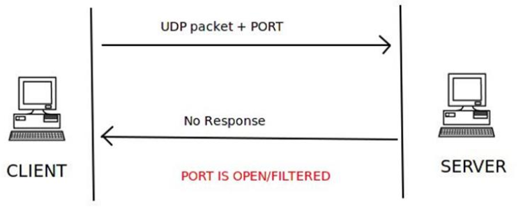

## 实验网络环境
- host、victim在同一局域网中
- host:192.168.94.3
- victim:192.168.94.4

## 实验思路

### 对于TCP扫描，分别在被扫描主机的指定端口(80)在打开状态、关闭状态及过滤状态下进行扫描

- 80端口初始状态

- 打开80端口

- 对80端口的入流量过滤

### 对于UDP扫描遇到一些问题，在我的虚拟机里没有确定处于打开状态的UDP端口，只有确定处于关闭状态和处于打开或过滤状态的端口，因此分别对这些端口进行扫描

 
## TCP flag中不同比特位含义

- SYN：用在建立连接时
- RST：断开连接、拒绝不法报文段、拒绝打开一个连接
- FIN：断开一个连接
- ACK：ACK=1时，确认序号段才有意义

			

## TCP connect scan

### 基于理论：
#### 当客户端给服务器的指定端口发送一个设置了SYN标志的TCP包，如果服务器的端口接受连接，它返回给客户端一个设置了SYN和ACK标志的TCP包，客户端再给服务器发送一个设置了ACK和RST标志TCP包，三次握手完成，说明服务器的指定端口处于开启状态；若服务器直接给客户端回复一个设置了RST标志的TCP包，说明服务器的指定端口处于关闭状态；若服务器没有任何返回，说明服务器的指定端口处于过滤状态

### 对victim的80端口进行扫描

#### 80端口关闭时

- 扫描结果，检测到目标的80端口处于关闭状态
	
	 

- 在victim上进行抓包观察,host向victim发送了一个SYN包，victim向host回复了一个RST包，可知victim的80端口确实处于关闭状态

	

#### 80端口打开后

- 扫描结果

	
- 在victim上抓包观察

	

#### 80端口被过滤

- 扫描结果

- 在victim抓包

## TCP stealth scan

### 基于理论：

#### 当客户端给服务器的指定端口发送一个设置了SYN标志的TCP包，如果服务器的端口接受连接，它返回给客户端一个设置了SYN和ACK标志的TCP包，客户端直接给服务器发送一个设置了RST标志的TCP包，这样能够避免防火墙的端口扫描检测，也是TCP隐形扫描的要点所在。否则服务器回复一个设置了RST标志的TCP包给客户端

- 端口打开状态

- 端口关闭状态

### 对victim的80端口进行扫描

#### 80端口关闭时

- 扫描结果

	

- 在victim上抓包观察

	
#### 80端口打开后

- 扫描结果

	

- 在victim抓包

	

#### 80端口入流量被过滤

- 扫描结果

		
	
	

## TCP XMAS scan

### 基于理论

#### 客户端给服务器指定端口发送一个设置了PSH、FIN、URG标志的TCP包，如果服务器没有回复任何信息，说明服务器的指定端口处于打开状态或过滤状态（FIN标志为断开连接）；若服务器回复了设置了RST标志的TCP包，说明服务器的指定断开处于关闭状态；若服务器返回ICMP包并且ICMP包的type值为3，code值为[1,2,3,9,10,13]，说明端口被过滤，无法判断端口是否开启

### 对victim的80端口扫描

#### 80端口处于关闭状态

- 扫描结果

- victim上抓包观察

#### 80端口打开后

- 扫描结果

- 在victim抓包

#### 80端口的入流量被过滤

- 扫描结果

- 在victim抓包

### xmas扫描中80端口打开和80端口被过滤的扫描显示结果一样是因为客户端给服务器发送了设置FIN标志的TCP包，若80端口正常开启，将会断开连接（没有建立连接的话也不会建立连接），所以服务器没有返回TCP包。若80端口被过滤，服务器的传输层应该是接受不到客户端发送的TCP包，所以也没有回复。

## UDP scan

### 基于理论 

#### UDP是一种无连接协议，发送数据包之前客户端与服务器不需要建立连接，而是假设目的地可达，直接发包。客户端向服务器的指定端口发送一个UDP包，若服务器返回一个UDP包说明服务器指定端口处于打开状态；若服务器返回一个type=3,code=3的ICMP包,说明目的端口处于关闭状态；若服务器返回一个type=3，code在[1,2,9,10,13]中的ICMP包，说明服务器的目的端口处于被过滤状态；若服务器没有返回任何消息，不能确定目的端口的状态，可能是打开状态，也可能是被过滤状态

- 端口处于打开状态

- 端口处于关闭状态

- 端口处于过滤状态

- 端口状态不确定

### 对victim进行扫描

#### 对处于关闭状态端口的扫描

- nmap确认处于关闭状态

- 扫描结果

- 在victim上抓包观察

#### 对被占用的端口扫描

- 被占用端口

- 扫描结果

##### 实际上68端口应该是打开状态

#### 对过滤端口的扫描

- 过滤前扫描

- 过滤

- 过滤后扫描

## 问题

在进行UDP端口扫描时，只有在扫描确定处于关闭状态的端口时服务器才会向客户端返回一个表目标端口关闭的ICMP包，在其他情况下（打开或过滤）均不会返回任何信息给客户端，这导致无法对目标端口状态的判断。

## 参考
    
	   
 [ns/2017-2/GameGamer/hw2/](https://github.com/GameGamer/ns/blob/29d019aa69dba28914dfca016fe064901aa4ae43/2017-2/GameGamer/hw2/)
       
[进程绑定到udp端口](https://www.cnblogs.com/likeyou1/p/8435195.html)

[textbook_ns](http://sec.cuc.edu.cn/huangwei/textbook/ns/chap0x05/main.html)

[port-scanning-using-scapy](https://resources.infosecinstitute.com/port-scanning-using-scapy/)
       

   

